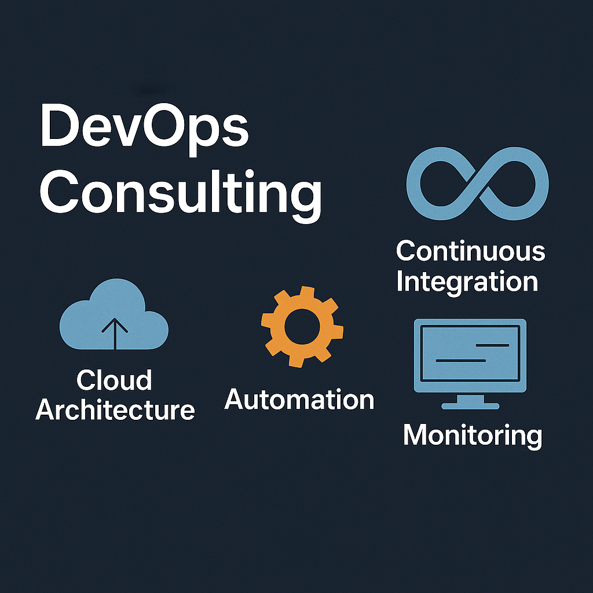

    

# Andrés Renaud
Curriculum Vitae
La Paloma, Rocha, Uruguay.
(+598) 98 935 266

<figure>
  
</figure>

## Preferred stack
- Managed Kubernetes nodes in any cloud.
- Terraform for IaaC
- CI/CD with Github Actions.
- Opensearch for monitoring

## Other tools used:
### Operating Systems
- Ubuntu, Centos, Suse, Redhat, Debian, Windows.
### Clouds
- AWS, Azure, VSphere, VCloud Director.
### IaaC and Configuration mMnagement
- Terraform, Ansible
### Automation for CI/CD
- Kubernetes, Docker, Git, Github-actions, Jenkins, Bitbucket pipelines
### Databases
- MySQL, MariaDB, SQLLite, InlfuxDB, Postgres, DynamoDB, BigTable, Hive, Elasticsearch, Databricks, Superset, Metabase.
### Programming languages
- Python, Typescript, C, Assembler, Bash, Java, JavaScript, Latex, R.
### Data Analysis
- R, Elasticsearch, Kibana, Python, Matlab, Tableau, Excel.
### Product Development
- Agile, Jira, Project Requirements, Planning and Management.
### Software Frameworks
- Spring Boot, Flask, Jboss, Laravel, Kivy, Bootstrap, Express
### Libraries** move to data analysis
- boto3, pandas, websocket, pyserial, ggplot2, refind, csv
### Security *****************+
- TWIGS 

## Experience
### DevOps
#### 2022–2024 DevOps Engineer and  Cloud Infrastructure Manager, Windifferent, Montevideo, Uruguay.
- M y role involved managing AWS infrastructure and application deployments using Terraform, Kubernetes, Octupus, Atlassian stack. Later promoted to manager I overviewd Data access process and network access policies.
- I debug an troubeshoutedd Dataplaform including Databricks and
- Superset and Metabase from ECS to Kubernetes
- Mangede CI/CD pipelines for CMA BE and FE using Octupus, bitbucket, JFrog.
Managed
- Opensearch and Grafana, but also used a centralized Datadog as a user to track some legacy assets
- Managed the cloud infra team to increase eficacy and documentation of our process including user authorization for data access and resource creation policies.

#### 2020–2022 DevOps Engineer, Upwave, Montevideo, Uruguay.
- My role involved managing AWS infrastructure and application deployments using Terraform, Kubernetes, Jenkins, CodeBuild and Github. Other tasks included DB management, security assessments and knowledge management.
- Researched and wrote Terraform best practices applicable to our company. Managed monitoring tools like Prometheus, Grafana and Cloudwatch.
- Thorough experience with log analysis using Elastisearch/Opensearch. Implemented tools in Typescript to automate Opensearch configuration.
- Added SSM Inventory for Terminal connection and created SM Documents to auto- matically provision servers.
- Created reports and managed AWS service using Python and Boto3. Mange Kubernetes cluster in EKS with Terraform and kubectl.
- Used Kustomize to add Nginx controller VS and VSR for applications.
- Created new Terraform modules and workspaces using Terraform Cloud to deploy application infrastructure compositions with multi-region support.
- Wrote DRY Terraform code for several AWS Service including: EC2, Beanstalk, EKS, EMR, VPC, S3, Cloudfront, Athena, SQS, Cloudwatch and others.
- Used Ansible to provision servers using Terraform.
- Managed and deploy Kubernetes cluster including Certificates, core services, node upgrades and cluster autoscaling.
- Managed CI/CD pipelines that use Jenkins and Github Actions.
- Addressed Security issues like UI Reddressing and Clickjacking, added DMARC protec- tion and run infrastructure analysis using TWIGS, certs management using ACM.

#### 2018–2019 Reliability Engineer, Netlabs, HG Offices, Montevideo, Uruguay.
- I was part of the System Reliability Engineering team responsible for setting up and managing production Linux environments.
- Developed Business as a Service products that run on VMware Private cloud. Managed virtual infrastructure using vCloud Director and Ansible.
- Coded and configured CI/CD pipelines with Jenkins and Git.
- Used Docker-Swarm to provide customized containers of Zabbix, ELK stack and HIDS for clients.
- Created an CMDB for the Virtual infrastructure and software running in all DCs using Ansible.
- Created hardenized virtual templates, automation scripts and designed a robust archi- tecture.
- Deployed critical updates to JAVA/Jboss applications over Linux systems: Ubuntu, Debian, Redhat and Centos.
- Actively documented and updated repositories.
- Administered dedicated firewalls and load balancers using iptables, F5, Forti. High availability web services with Apache, Nginx, Keepalive, HA Proxy.
- Installation and Management of performance monitoring tools such as: Zabbix, Elas- ticsearch, Kibana, Grafana and others.
- Creation of several data visualizations, like colorpleths, using ELK stack with various beats and scripts for metrics sources.
- 2017–2018 Reliability Engineer, Netlabs, HQ, Montevideo,Uruguay.
- SRE engineering for several small clients. Particularly, I put in production a responsive JS/PHP web application where you could buy tickets for the metro in Sao Paulo, Brazil, using your Paypal account.
- Integrated application payments with Paypal. Administered virtual infrastructure in AWS. Setup Jira Service Desk.
- Created developer environments based on Docker. Did Redmine demos for clients.
- Did ELK stack demos for clients.
- Presented Hadoop Azure’s PaaS HDInsights to clients.
- Integrated Tableau Desktop with Hortonworks’ Hadoop and JDBC/ODBC Drivers for important TELCO.
- Acted as Level 3 System administrator for Netgate Uruguay’s mail and web hosting solutions.

### Developer

#### 2020 Python Full Stack Developer, BairesDev, Remote, Montevido,Uruguay.
- Porting algorithms developed in Python by Data Science team to Cloud Production environments.
- SRE engineering for several small clients. Particularly, I put in production a responsive JS/PHP web application where you could buy tickets for the metro in Sao Paulo, Brazil, using your Paypal account.
- Worked for a IoT biomedical company Biointellisense.
- Ported the alerting algorithm to production level Google Cloud Functions in Python with Pandas library.
- Modified Java libraries to accept new data available.
- Experience with Big tables and protocol buffers.
- Introduced to Airflow ETL workflow management.
- Agile methodology using Jira and Bitbucket for task and source code management.

#### 2014–2019 Technical Leader, Boxes, Montevideo, Uruguay-
- I work together with Boxes engineers and providers to build interactive, internet connected, vending machines.
- Wrote the technical description for project founding.
- UI/UX re-design based Python/Kivy framework.
- Hardware shield for Raspberry Pi design based on Arduino Leonardo.
- Web Admin console programming using Java, JS, websockets and Bootstrap.
- Awarded by National Association of Investigation and Innovation, ANII.
- 2014 Developer, Freelancer, Montevideo, Uruguay.
- I offered industrial grade Linux computers to deal with limmiting costs of servers, licenses, PLCs and trainning of closed solutions like ABB, Siemmens, Pheonix Contacts, to name a few I’ve used.
- Developed a Mixed GPRS/Zigbee network using IMod products from Techbase. Customizable IoT platform based on Arduino and Raspberry Pi.
- UpWork: Configured Ubuntu Servers and integrated voice call to an Emotional Chat Bot Application using: NodeJS, Express, SocketIO, Google Speech Api and OpenMary TTS.

### Site Operations
#### 2014–2017 Data Center Technical Leader, IBM, Montevideo, Uruguay.
- Assets and service contracts manager for Data Center Operations at IBM, Uruguay.
- Documentation and compliance of DC operation, using Agile Methodology.
- Planning and execution of maintenance services over DCs Site infrastructure (UPSs, Generator Groups, HVAC, Panels, BMS, Security, FDS).
- Reporting of Site status to global/regional team. My goal was to reassure RL2 and a RL3 level compliance for Data Centers located in Uruguay.
- Data Center project managements, including new equipment, exposure correction and move outs.

#### 2007–2014 Process Control Engineer, ISUSA, Ciudad del Plata, San Jose.
- I ensured that process control, alarming and industrial communications in sulfuric acid plants and fertilizer plants worked as expected.
- Created an inventory and maintenance plan for all electric equipment in the factories. Installed and administered several Windows servers for critical operations.
- Created automatic reporting of gas emissions to government entity using Office and Visual Basic Script.
- Design and build the control system for a new water treatment plant.
- Developed several process control UIs in using Ifix Scada and Visual Basic.
- Leaded the WAN upgrade to achieve Unified Communications.
- Installed radio links to increase industrial WAN network coverage.
- Implemented Video over MPLS for enterprise communications using LifeSize hardware.

#### Other
- In 2006 I Worked for the Municipality of Montevideo for 3 months in the hardware repair and delivery center while finishing my Electric Engineer Degree
- In 1999 through 2000 I worked cleaning and restocking a Couche Tard Minimarket on the weekends in Montreal, Canadá while studying there.
- 

# Education
## Courses
- 2022 Terraform Beginner to Advanced, Online at
2020 Amazon Elastic Kubernetes Service Workshop, Online at
2019 Use Python to access web data, Online at
- 2019 TEFL English Certificate, Thresholds Institute, Prague, Czech Republic
2018 Agile Scrum Master Introduction Course,XN, Montevideo, Uruguay
- 2017 Introduction to Tableau, Delloite Montevideo, Uruguay
- 2017 Azure Cloud Specialist + Open Source, Online at  2017 Amazon AWS Solution Architect, Online at
- 2015 Introduction to Agile, IBM, Montevideo, Uruguay

## Academic Studies
- 2009–2012 Impedance Spectroscopy Specialization, Facultad de Ciencias. UDELAR, Montev- ideo, Uruguay. Field of research: Impedance spectroscopy over modified electrodes for specific polly-saccharides detection.
- 2001–2008 Electric Engineer, Facultad de Ingenieria, UDELAR, Montevideo, Uruguay. Thesis: Mod-bus Wireless Communication hardware for Home and Industry. Automation
- 1999–2001 Pure and Applied Science, Vanier College, Montreal, Canada.

# Projects
## DevOps
### DevOps Engineer @ Upwave.
- Advanced IaC development using Terraform Management of Kubernetes clusters.
- Deployment of microservices with Kustomize.
- AWS Service Configurations including: EKS, Beanstalk, RDS, EMR, Cloudfront, SQS, Athena and others.
- Developed Ansible scripts to fully automate the provisioning of compute environments
- Log management using Elasticsearch.
- Monitoring Kubernetes cluster using Prometheus and Grafana.

### DevOps Engineer @ Freelancer.
- Developed infrastructure as code using Terraform.
- Deploys VPC, ALBs, IGW and integrates it with EKS cluster on AWS
- Configures Autoscaling groups and Kubernetes Service Account based Roles to scale applications.
- Application Monitoring using Prometheus and Grafana

### DevOps Engineer@ Upwork.

- Implemented with stateless Docker containers on AWS
- Uses ECS and Fargate to provide a robust and scalable service.
- Uses Docker-Compose to develop locally or remotely.
- Created bash scripts that builds and pushes the new image to ECR.
- Used Python scripts to convert a CSV inventory to CFG files for Nagios.
- 
### SRE Engineer for Antel ASVAC.
- Applied regular updates to single sign on portal for Antel appilcations.
- Analyzed logs and created reports and visuals using ELK stack.
- Managed Networking infrastructure: Load balancers, Reverse Proxies, NFS.
- Worked in the migration of frontend and api components for Vera TV to a new RL3 DC.

### System administrator for XN Brasil.

- Full stack application debugging.
- Production deployment of PHP/Laravel application on AWS.
- Jira Service Desk deployment and configuration.

## Developer
### Python Full Stack Developer for Bio intellisense.
- Used Pandas framework to analyze data and create event notifications and alerts. Optimized and cleaned Data Science algorithm for production running on GCP Cloud Functions.
- Created new data pipelines for notification using proto buffers
- Fetched and saved detected events to big tables
- Wrote integration tests using unittest and pytest.

### Product Developer for Antel NDG.
- Created a multilayer Reference Architecture for IaaS Clients on vCloud Director.
- Managed VM templates catalog for Linux OS using Ansible.
- Managed Web access with Apache mod_proxy, pfSense and vShields.
- Provided ELK stacks, and Zabbix Servers using Docker-Swarm.

### Fullstack Developer for BOxES.
- Changed python library pyGame for Kivy to enable a better user experience.
- Re-designed Raspberry Pi "shield" circuit boards to decrease machines building time and components costs.
- Created an IoT Broker Service in using JAVA websockets.
- Created a Bootstrap JS/JAVA web console and deployed it on AWS using Gradle.
- Wrote a python client to enable M2M communication through OpenVPN.

## Public Speaking
### Virtual Infrastructure Best Practices.
- Presented a reference multilayer architecture to team and clients at HG (
2019).
### Open Source and Big Data on Azure.
- Presentation given in collaboration with Microsoft Uruguay to Netlabs clients at Sinergia Tech (2017).
### Study of metal-protein interactions using Impedance Spectroscopy .
- Presentation of scientific research at "CSIC" event and Instituto de Higiene, UDELAR
(2010,2011).
### Voice Enhancing using Artificial Neural Networks.
- Part of a specialization course in Artificial in Neural Networks, Facultad de Ciencias,
UDELAR (2009).

# Languages
- Spanish - Native language English - Advanced
- Portuguese - Basic speaking and listening
- 
# Interests
- Music
- Sports: Aikido and Surf
- Food and Nutrition	
- History