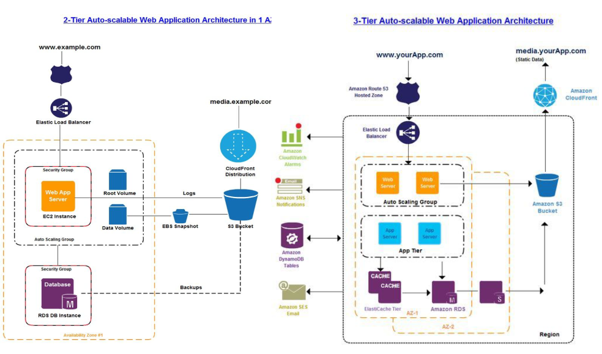

# CV for Senior DevOps Engineer

<figure>   </figure>

## Table of Contents

- [Technical Stack](#technical-stack)
- [Experience](#experience)
    - [DevOps Roles](#devops-roles)
    - [Developer Roles](#developer-roles)
    - [Site Operations](#site-operations)
- [Projects](#projects)
    - [DevOps Projects](#devops-projects)
        - [Windifferent Infrastructure Automation](#devops-engineer--windifferent)
        - [Upwave Multi-Region IaC](#devops-engineer--upwave)
        - [Netlabs Cloud Infrastructure](#devops-engineer--netlabs)
        - [Upwork Containerization](#devops-engineer--upwork)
        - [Antel ASVAC SRE](#sre-engineer-for-antel-asvac--netlabs)
        - [XN Brasil System Administration](#system-administrator-for-xn-brasil)
    - [Developer Projects](#developer-projects)
        - [BioIntellisense Data Pipelines](#python-full-stack-developer-for-biointellisense)
        - [Antel NDG Product Development](#product-developer-for-antel-ndg)
        - [Boxes IoT Development](#full-stack-developer-for-boxes)
- [Education](#education)
    - [Courses](#courses)
    - [Academic Studies](#academic-studies)
- [Public Speaking](#public-speaking)
- [Languages](#languages)
- [Interests](#interests)

---

## Technical Stack

My ideal technology stack would be:

- Kubernetes for microservices and functions
- Terraform for IaC
- CI/CD with GitHub Actions
- OpenSearch for observability

That said, I am experienced with a wide variety of tools—too many to remember them all—some of which are listed below.

### Technical Skills

| Category | Technologies |
|----------|-------------|
| **Operating Systems** | Ubuntu, CentOS, SUSE, RedHat, Debian, Windows |
| **Cloud Platforms** | AWS, Google Cloud, Azure, VCloud Director |
| **IaC & Configuration Management** | Terraform, Ansible |
| **Computing Clusters** | Kubernetes, Swarm, Hadoop, MapReduce |
| **CI/CD Automation** | Kubernetes, Docker, Git, GitHub Actions, Jenkins, Bitbucket Pipelines |
| **Monitoring & Observability** | OpenSearch, Grafana, Grafana Cloud, Datadog, CloudWatch, Prometheus, Data Prepper, OTEL, Fluent-bit, Fluentd, Logstash, Graylog, Syslog |
| **Databases** | MySQL, MariaDB, SQLite, InfluxDB, PostgreSQL, DynamoDB, BigTable, Hive, Elasticsearch, Databricks, Superset, Metabase |
| **Programming Languages** | Python, TypeScript, C, Assembler, Bash, Java, JavaScript, LaTeX, R |
| **Data Analysis** | OpenSearch, R, Elasticsearch, Kibana, Python, MATLAB, Tableau, Excel |
| **Product Development** | Agile, Jira, Project Requirements, Planning and Management |
| **Software Frameworks** | Spring Boot, Flask, JBoss, Laravel, Kivy, Bootstrap, Express |
| **Libraries** | boto3, pandas, websocket, pyserial, ggplot2, refind, csv |
| **Security** | Apache WAFs, DB and OS hardening, HIDS for Kubernetes with Elasticsearch, TWIGS, AWS Well-Architected Framework, CompTIA Security+ (in progress) |

## Experience

### DevOps Roles

#### [2022–2024 DevOps Engineer and Cloud Infrastructure Manager, Windifferent, Montevideo, Uruguay.](https://www.windifferent.com/)
- Managed AWS infrastructure and application deployments using Terraform, Kubernetes, Octopus, and the Atlassian stack. Later promoted to manager; oversaw the data access process and network access policies.
- Managed, debugged, and troubleshot data platforms including:
    - Databricks and Kafka connectivity to different data sources.
    - Created a process to authorize access to data using roles.
- Managed data consumption tools like Superset and Metabase, migrating from ECS to Kubernetes.
- Managed CI/CD pipelines for CMA BE and FE and other microservices using Octopus, Bitbucket, and JFrog.
- Used OpenSearch and Grafana, and also worked with a centralized Datadog instance to monitor legacy assets.
- Managed the DBA team to perform:
    - Hardware upgrades, software updates, schema changes.
    - Enabled/disabled HA and replication.
    - Secured networks and implemented password rotation.
    - Minimized downtime during operations.
- Increased our IaC coverage significantly by:
    - Adding an EKS cluster and VPC to Terraform and managing most accounts.
    - Deploying and configuring an OpenSearch cluster using Terraform and Python.
    - Fixing broken code in Databricks installations, which had previously been applied manually.
    - Developing a process to automate those changes, though it wasn't fully adopted.
- Managed workflow through Jira and tracked work sources to optimize processes and increase capacity.
- Led the cloud infrastructure team in improving documentation and defining policies for user authorization and resource creation.
- Used Jira extensively to track project progress and team deliveries.

#### [2020–2022 DevOps Engineer, Upwave, Montevideo, Uruguay.](https://www.upwave.com/)
- Managed AWS infrastructure and application deployments using Terraform, Kubernetes, Jenkins, CodeBuild, and GitHub. Additional responsibilities included database management, security assessments, and internal documentation.
- Researched and documented Terraform best practices tailored to the company.
- Managed monitoring tools like Prometheus, Grafana, and CloudWatch.
- Extensive experience with log analysis using Elasticsearch/OpenSearch. Created TypeScript tools to automate OpenSearch configuration.
- Added SSM Inventory for terminal access and created Systems Manager Documents to automate server provisioning.
- Created reports and managed AWS services using Python and Boto3.
- Managed multiple EKS clusters using Terraform and `kubectl`.
- Used Kustomize to integrate NGINX controllers with VS and VSR configurations.
- Built new Terraform modules and workspaces using Terraform Cloud for multi-region deployments.
- Wrote DRY Terraform code for AWS services including EC2, Beanstalk, EKS, EMR, VPC, S3, CloudFront, Athena, SQS, and CloudWatch.
- Used Ansible to provision servers alongside Terraform.
- Managed and deployed Kubernetes clusters, including certificate handling, core services, node upgrades, and autoscaling.
- Built CI/CD pipelines with Jenkins and GitHub Actions.
- Addressed security issues like UI redressing and clickjacking, added DMARC protection, and ran infrastructure analysis using TWIGS and ACM certificates.

#### [2018–2019 Reliability Engineer, Netlabs, HG Offices, Montevideo, Uruguay.](https://www.netlabsglobal.io/)
- Part of the Site Reliability Engineering team, responsible for managing Linux production environments.
- Developed Business-as-a-Service solutions on VMware private cloud.
- Managed virtual infrastructure using vCloud Director and Ansible.
- Developed CI/CD pipelines using Jenkins and Git.
- Used Docker Swarm to deliver custom containers with Zabbix, ELK Stack, and HIDS for clients.
- Created a CMDB of virtual infrastructure and software using Ansible.
- Built hardened virtual machine templates and automation scripts; contributed to architecture design.
- Deployed critical updates to Java/JBoss applications across Ubuntu, Debian, RedHat, and CentOS.
- Maintained and updated technical documentation.
- Administered firewalls and load balancers using iptables, F5, and Fortinet.
- Delivered high-availability web services using Apache, NGINX, Keepalived, and HAProxy.
- Deployed and managed performance monitoring tools such as Zabbix, Elasticsearch, Kibana, and Grafana.
- Built data visualizations (e.g., choropleths) using the ELK stack with Beats and custom scripts.

#### [2017–2018 Reliability Engineer, Netlabs, HQ, Montevideo, Uruguay.](https://www.netlabsglobal.io/)
- Provided SRE services for several small clients.
- Deployed a responsive JS/PHP web application for São Paulo metro ticketing with PayPal integration.
- Managed virtual infrastructure in AWS.
- Set up Jira Service Desk and created Docker-based developer environments.
- Presented Redmine and ELK stack demos to clients.
- Delivered an HDInsight PaaS presentation using Microsoft Azure.
- Integrated Tableau Desktop with Hortonworks Hadoop using JDBC/ODBC for a major telecom provider.
- Acted as Level 3 System Administrator for Netgate Uruguay's email and hosting services.

### Developer Roles

#### [2020 Python Full Stack Developer, BairesDev, Remote, Montevideo, Uruguay](https://www.biointellisense.com/)
- Ported Data Science algorithms from Python notebooks to production using GCP Cloud Functions and Pandas.
- Provided SRE services and helped deploy JS/PHP web apps.
- Worked for BioIntellisense on biomedical IoT projects.
- Modified Java libraries to accommodate expanded data inputs.
- Built data pipelines using protocol buffers and Bigtable.
- Wrote integration tests using `unittest` and `pytest`.
- Followed Agile practices using Jira and Bitbucket.

#### [2014–2019 Technical Leader, Boxes, Montevideo, Uruguay.](https://boxesdevices.com/)
- Developed interactive vending machines with engineers and suppliers.
- Authored technical documentation for grant applications.
- Led UI/UX redesign using Python/Kivy.
- Designed Raspberry Pi shields using Arduino Leonardo.
- Built a JavaScript/Java admin console with Bootstrap, deployed on AWS using Gradle.
- Developed Python clients for OpenVPN-based M2M communication.
- Replaced PyGame with Kivy to improve embedded UI performance.
- Awarded by ANII (National Research and Innovation Agency).
- As an entrepreneur, I wanted to supply industrial-grade Linux machines as alternatives to proprietary PLC systems (ABB, Siemens, Phoenix Contact).
- Built PoC of hybrid GPRS/Zigbee network using IMod devices from Techbase.

Look at [this project](https://github.com/andresr27/portfolio/tree/master?tab=readme-ov-file#full-stack-developer-for-boxes) for more details on the experience.

### Site Operations

#### [2014–2017 Data Center Technical Leader, IBM, Montevideo, Uruguay.](https://www.ibm.com/account/uy/es/)
- Managed physical assets and service contracts for IBM's data centers in Uruguay.
- Ensured operational compliance using Agile methods.
- Planned and executed infrastructure maintenance (UPS, generators, HVAC, panels, BMS, security, FDS).
- Reported site status to global/regional managers with the aim of achieving RL2 and RL3 compliance.
- Led infrastructure projects including equipment deployments and move-outs.

#### [2007–2014 Process Control Engineer, ISUSA, Ciudad del Plata, San José.](https://isusa.com.uy/)
- Ensured industrial communication and control systems functioned reliably in fertilizer and sulfuric acid plants.
- Built inventory and maintenance plans for all electrical equipment.
- Administered Windows servers for critical operations.
- Automated gas emissions reporting using Office macros and VBScript.
- Designed and deployed a control system for a new water treatment plant.
- Created SCADA interfaces using iFIX and Visual Basic.
- Upgraded WAN infrastructure to enable unified communications.
- Installed industrial radio links to improve site-wide networking.
- Implemented video-over-MPLS conferencing with LifeSize hardware.

#### Other
- In 2006, worked at the Municipality of Montevideo repairing and delivering computer hardware while finishing my Electrical Engineering degree.
- In 1999–2000, worked part-time at a Couche-Tard minimarket in Montreal, Canada, restocking and cleaning while attending college.

# Projects

## DevOps Projects

### Senior DevOps Engineer @ Windifferent

This company was my biggest challenge yet. I began as a Senior DevOps engineer building a new monitoring system for applications running in distributed K8s clusters (multiple clouds, more than 5, and not the most well-known) with a few things running on Linux instances.

Cluster provisioning was straightforward with Kustomize, but for instances, we had to use Ansible and AWX roles. I delivered that, and then things changed—I started helping people with Kafka clusters in K8s and also Databricks setups with Terraform on AWS. Remembering it gives me chills.

Then I was promoted to manager of DevOps and DBAs, but there's a separate section for that. These are some other things I did:
- Advanced IaC development using Terraform and Terragrunt.
- Managed Kubernetes clusters created with Terraform and Ansible roles in AWS.
- Deployed microservices and operators with Helm including Kafka, Prometheus, Superset, DataPrepper, and Grafana Agent.
- Configured AWS services including: EKS, ECS, RDS, CloudFront, SQS, OpenVPN, OpenSearch, Lambda, SNS, CloudWatch.
- Developed Ansible scripts to automate provisioning of EC2 instances for general purposes, bastions, and reverse proxies.
- Managed application logs with OpenSearch.
- Monitored Kubernetes clusters using Prometheus and Grafana, OTEL and Data Prepper.
- Added Databricks and Kafka connectivity to different data sources.

Unfortunately, I don't have any code to share with you, as it was proprietary and deleted when I finished the job.

### Cloud Infrastructure Manager @ Windifferent

My goal was to increase reliability and optimize costs. My team managed AWS infrastructure and application deployments for several teams in the company.

The company's assets were distributed across more than 10 AWS accounts connected through different methods: Peerings, Proxied connections, Internet VPN.

Differences in how we should manage security, cloud architecture, and monitoring led to the termination of my contract. Below are more details on other tasks I performed:
- Oversaw the data access process and network access policies for AWS resources.
- Created a process to authorize access to data using roles and groups in Databricks.
- Managed data consumption tools like Superset and Metabase, migrating from ECS to Kubernetes.
- Created documentation and secured access to our database.
- Proposed reference architecture to unify company assets and decrease the exposure surface.
- Planned migration.
- Created Python Synthetic checker agent to log checks from different networks, i.e., VPN, Internet (Whitelist), other accounts, other Orgs.
- Managed the DBA team to perform:
    - Hardware upgrades, software updates, schema changes.
    - Enabled/disabled HA and replication.
    - Secured networks and implemented password rotation.
    - Minimized downtime during operations by using multi-AZ and proper DNS routing.
- Managed workflow through Jira and tracked work sources to optimize processes and increase capacity.
- Led the cloud infrastructure team to improve documentation and define policies for user authorization and resource creation.
- Used Jira extensively to track project progress and team deliveries.

Unfortunately, I don't have any code to share with you, as it was proprietary and deleted when I finished the job.

### Senior DevOps Engineer @ Upwave

In this project, my first goal was to migrate and improve the current IaC to make it multi-region and automated—i.e., created, configured, and running after a disaster recovery or new region deployment. That was the goal, and we got pretty close. For example, I developed API tools that would connect to OpenSearch and create Dashboards and Alerts after a Developer added the JSON configuration to the application repository. This allowed them to create custom Dashboards and Alerts for each new feature without any more hassle than filling up the values in the JSON prototype or exporting them from OpenSearch to create in limited production environments or new regions.

Unfortunately, I don't have any code to share with you, as it was proprietary and deleted when I finished the job.

- Advanced IaC development using Terraform and Terraform Cloud Workspaces.
- Managed Kubernetes clusters.
- Deployed microservices with Kustomize to clusters in different regions.
- Used Kustomize to integrate NGINX controllers with VS and VSR configurations.
- Configured AWS services including: EKS, Beanstalk, RDS, Glue, Firehose, EMR, CloudFront, SQS, Athena, and others.
- Developed Ansible scripts to automate provisioning of compute environments.
- Managed CI/CD pipelines for CMA BE and FE and other microservices using Octopus, Bitbucket, and JFrog.
- Managed logs with OpenSearch, developed an API client to automate configuration of Indexing, Lifecycle, and Dashboard, among other things.
- Monitored Kubernetes clusters using Prometheus and Grafana, Fluent-bit and OpenSearch.
- Increased our IaC coverage significantly by:
    - Adding an EKS cluster and VPC to Terraform and managing most accounts.
    - Deploying and configuring an OpenSearch cluster using Terraform and Python.
    - Fixing broken code in Databricks installations, which had previously been applied manually.

Unfortunately, I don't have any code to share with you, as it was proprietary and deleted when I finished the job.

### DevOps Engineer @ Netlabs

I started as a SysAdmin, studying a lot: RedHat, Hadoop, Elasticsearch, AWS, and Azure. Then I prepared presentations for clients and teams. Soon after I proved my worth, I was tackling small projects, back for some roles without one, and built a couple of PoCs.

- Gave talks about [Cloud Infrastructure Best Practices](https://github.com/andresr27/portfolio/tree/master/public/DevOps_Administration/Presentations)
- Built infrastructure as code using Terraform.
- Deployed VPCs, ALBs, IGWs, and integrated them with EKS clusters on AWS.
- Configured autoscaling groups and Kubernetes service-account-based roles for application scaling.
- Implemented application monitoring with Prometheus and Grafana.

<figure>   </figure>

### SRE Engineer for Antel ASVAC @ Netlabs

During my time at Netlabs, I had the opportunity to work on critical infrastructure for Antel, Uruguay's national telecommunications company. My role focused on maintaining and enhancing the single sign-on portal that served as the gateway to various Antel applications. This project required a meticulous approach to system updates, security hardening, and performance optimization to ensure seamless service delivery to thousands of users.

- Applied regular updates to the single sign-on portal for Antel applications.
- Analyzed logs and generated visual reports using the ELK stack.
- Managed networking infrastructure including load balancers, reverse proxies, and NFS.
- Participated in the migration of frontend and API components for Vera TV to a new RL3 data center.

<figure>   </figure>
<figure>   </figure>

### DevOps Engineer @ Upwork

As a freelance DevOps engineer, I worked with various clients to containerize their applications and establish robust deployment pipelines on AWS. This role allowed me to work with diverse technology stacks and solve unique infrastructure challenges for each client. I particularly enjoyed helping startups establish their cloud foundations with scalable, cost-effective solutions that could grow with their business.

- Implemented stateless Docker containers on AWS.
- Used ECS and Fargate to provide scalable, resilient services.
- Used Docker Compose for local and remote development.
- Created Bash scripts to build and push images to ECR.
- Wrote Python scripts to convert CSV inventory into Nagios-compatible CFG files.

### System Administrator for XN Brasil

I supported XN Brasil in stabilizing their production environment and improving their deployment processes. This role involved deep diving into full-stack application debugging and establishing more reliable deployment practices. I helped transition their PHP/Laravel application to AWS and implemented Jira Service Desk to streamline their internal support processes.

- Debugged full-stack applications in production.
- Deployed a PHP/Laravel application to AWS.
- Deployed and configured Jira Service Desk.

## Developer Projects

### Python Full Stack Developer for BioIntellisense

Working with BairesDev for BioIntellisense, I contributed to biomedical IoT projects that required both data science expertise and production engineering skills. My main responsibility was bridging the gap between research algorithms and production-ready systems, ensuring that data science models could run efficiently and reliably in a cloud environment while maintaining scientific accuracy.

- Used the Pandas framework to analyze data and generate alerts.
- Optimized Data Science algorithms for deployment in GCP Cloud Functions.
- Built data pipelines using protocol buffers.
- Stored and retrieved events from Bigtable.
- Wrote integration tests using `unittest` and `pytest`.

### Product Developer for Antel NDG

At Netlabs, I worked on designing infrastructure solutions for Antel's NDG project, focusing on creating a robust IaaS offering using vCloud Director. This project involved architecting multi-tenant environments with proper isolation, security, and monitoring. I enjoyed the challenge of building enterprise-grade solutions that met the high reliability standards expected from a national telecommunications provider.

<figure>   </figure>

- Designed a multilayer reference architecture for IaaS clients using vCloud Director.
- Managed Linux VM templates using Ansible.
- Managed web access with Apache mod_proxy, pfSense, and vShields.
- **Deployed ELK stack and Zabbix servers using Docker Swarm.**

### Full Stack Developer for Boxes

As Technical Leader at Boxes, I led the development of interactive vending machines, combining hardware and software innovation. This entrepreneurial experience taught me how to balance technical excellence with business constraints. I particularly enjoyed the cross-disciplinary nature of the work, which ranged from circuit board design to cloud administration and everything in between.

- [Replaced PyGame with Kivy for improved embedded UI performance.](https://github.com/andresr27/portfolio/tree/master/public/Software_Development/Device%20UI-UX/Pi2Arduino)
- Redesigned Raspberry Pi "shield" circuit boards to reduce cost and build time.
- [Created an IoT broker service using Java WebSockets.](https://github.com/andresr27/portfolio/tree/master/public/Software_Development/Web%20Admin)
- Developed a Bootstrap/JavaScript admin console, deployed on AWS with Gradle.
- Wrote a Python client to enable M2M communication via OpenVPN.
- Managed circuit board requirements for CAD provider and manufacturer in China, with Seeed Studio, another company that has grown a bit.

# Education

## Courses
- 2025 Hackerrank Python Training.
- 2025 Entry-Level Security – [Cybrary](https://app.cybrary.it/)
- 2024 Introduction to Deep Q Learning – Udemy
- 2022 Terraform Associate Certification – [HashiCorp](https://developer.hashicorp.com/terraform/tutorials/certification-003/associate-study-003)
- 2022 Terraform Beginner to Advanced – Udemy
- 2020 Amazon Elastic Kubernetes Service Workshop – Online
- 2019 Use Python to Access Web Data – Online
- 2019 TEFL English Certificate – Thresholds Institute, Prague, Czech Republic
- 2018 Agile Scrum Master Introduction Course – XN, Montevideo, Uruguay
- 2017 Introduction to Tableau – Deloitte, Montevideo, Uruguay
- 2017 Azure Cloud Specialist + Open Source – Online
- 2017 AWS Solutions Architect – Online
- 2015 Introduction to Agile – IBM, Montevideo, Uruguay

## Academic Studies
- 2009–2012 Impedance Spectroscopy Specialization – Facultad de Ciencias, UDELAR, Montevideo, Uruguay  
  *Field of research: [Impedance spectroscopy over modified electrodes for specific polysaccharide detection](https://github.com/andresr27/portfolio/blob/master/Electric_Engineering/Impedance_Spectroscopy_over_metal-protein_interactions/Poster_impedancia5.pdf).*
- 2001–2008 Electrical Engineering – Facultad de Ingeniería, UDELAR, Montevideo, Uruguay  
  *[Thesis: Modbus wireless communication hardware for home and industrial automation.](https://github.com/andresr27/portfolio/blob/master/Electric_Engineering/Wireless_WPAN_devices_with_Modbus-TCP/Poster_WiDO.jpg)*
- 1999–2001 Pure and Applied Science – Vanier College, Montreal, Canada

## Public Speaking

### Virtual Infrastructure Best Practices
- Presented a multilayer reference architecture to internal teams and clients at HG (2019).

### Open Source and Big Data on Azure
- Delivered a presentation at Sinergia Tech (2017) in collaboration with Microsoft Uruguay and Netlabs.

### Study of Metal–Protein Interactions Using Impedance Spectroscopy
- Presented scientific research at CSIC and Instituto de Higiene, UDELAR (2010, 2011).

### Voice Enhancement Using Artificial Neural Networks
- Presented as part of a specialization course in neural networks, Facultad de Ciencias, UDELAR (2009).

# Languages
- Spanish – Native language
- English – Advanced
- Portuguese – Basic (speaking and listening)

# Interests
- Music
- Sports: Aikido and Surf
- Food and Nutrition
- History
